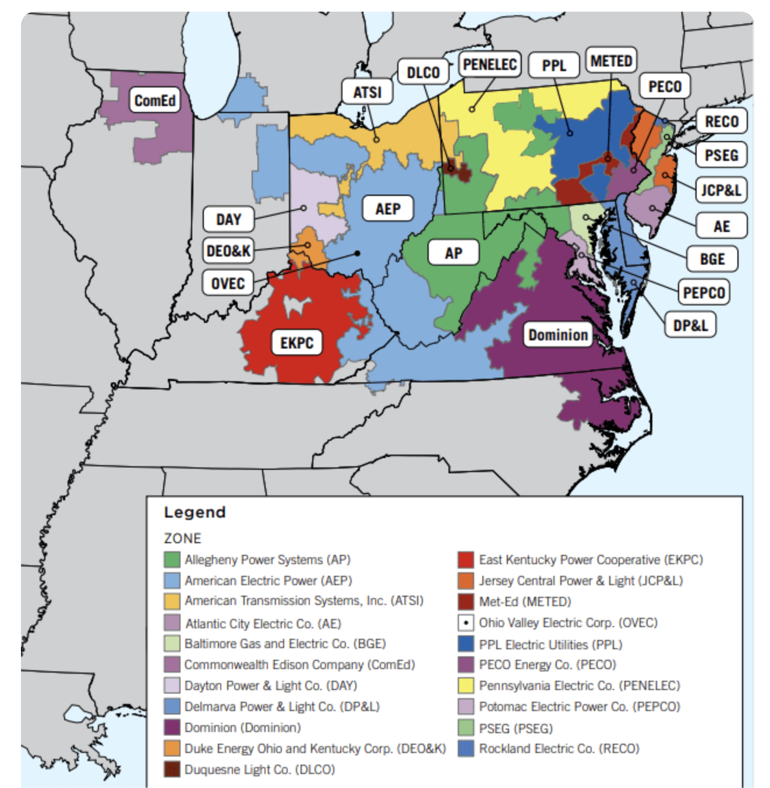
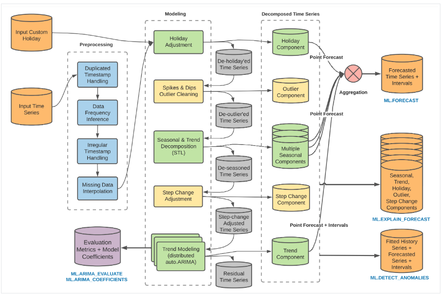
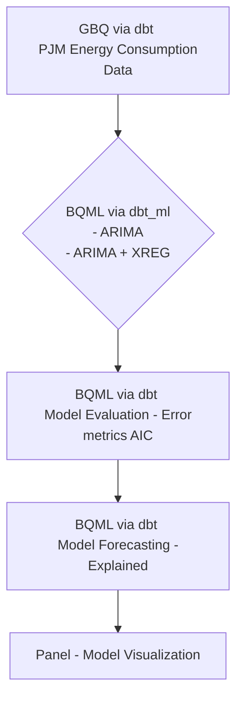

# Hackaton - Run ML models in BQML and Vertex AI

This package was developed with contributions from:

- Karin Wu: Arima Plus Model
- Jose Luis Moscoso: Arima Model

## Hackathon Idea

As part of the 2024 Hackaton, we explored BQML so that we can execute ML workflows without moving data from GCP. We implemented a pipeline using a dbt packages [dbt_ml](https://github.com/kristeligt-dagblad/dbt_ml/tree/v0.6.1/), so that we query dataset from GBQ, train models in BQML, track results, metrics and parameters, and visualize our results on a [Panel](https://panel.holoviz.org/) dashboard.

More details can be found in this [document]([https://docs.google.com/document/d/1g-WOK1-sBrvwk3XVicP6HWx0Xl2x3zlgnFW2JCZxwys/edit?tab=t.0](https://github.com/ywu755/Hackathon-2024-ML-models-in-BQML-and-Vertex-AI/blob/main/reference/Hackthon%20Idea.docx)).


## bqml structure

``` bash
├── hackathon_bqml
│   ├── hackaton_bqml
│   │   ├── model_visualization.py
│   ├── hackaton_bqml_dbt
│   │   ├── dbt_project.yml
│   │   ├── macros
│   │   │   ├── arima_plus_xreg.sql
│   │   │   ├── evaluate_arima_plus_xreg.sql
│   │   │   ├── explain_arima_plus_xreg.sql
│   │   │   ├── forecast_arima_plus_xreg.sql
│   │   ├── models
│   │   │   ├── hourly_energy_pjm
│   │   │   │   ├── arima_model.sql
│   │   │   │   ├── evaluate_arima_model.sql
│   │   │   │   ├── forecast_arima_model.sql
│   │   │   │   ├── explain_forecast_arima_model.sql  
│   │   │   │   ├── arima_plus_xreg_{utility}.yml
│   │   │   │   ├── forecast_arima_plus_xreg_model_{utility}.yml
│   │   │   │   ├── evaluate_arima_plus_xreg_model_{utility}.yml
│   │   │   │   ├── explain_arima_plus_xreg_model_{utility}.yml
│   │   ├── packages.yml
│   └── README.md
```

### bqml dataset:
For our hackaton, we used the [PJM Hourly Energy Consumption Data](https://www.kaggle.com/robikscube/hourly-energy-consumption) dataset from Kaggle. The dataset contains hourly energy consumption data from PJM Interconnection LLC, a regional transmission organization (RTO) in the United States. The dataset contains hourly power consumption data from 2002 to 2018.

<p align="center">

</p>

## bqml ARIMA PLUS model
We are using the [ARIMA PLUS model](https://cloud.google.com/bigquery/docs/reference/standard-sql/bigqueryml-syntax-create-time-series) from BigQuery. The ARIMA model is a time series model that uses autoregressive integrated moving average (ARIMA) techniques to forecast future values. 

<p align="center">

</p>


### bqml scripts:




### How to execute the code:
To build a model, run the following command:
``` python
$  dbt run --select models/hourly_energy_pjm/arima_model.sql
```

To evaluate a model, run the following command:
``` python
$  dbt run --select models/hourly_energy_pjm/evaluate_arima_model.sql
```

To forecast with a model, run the following command:
``` python
$  dbt run --select models/hourly_energy_pjm/forecast_arima_model.sql
```

To visualize historical vs forecasted values with a model on a dashboard, run the following command:
``` python
$  python hackathon_bqml/model_visualization.py --forecast_gbq_table explain_forecast_arima_model
```
